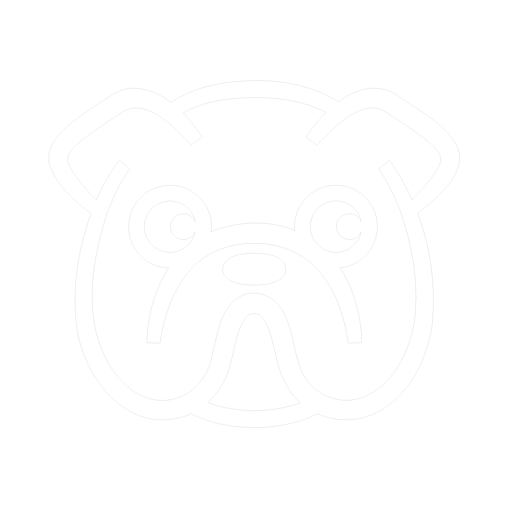
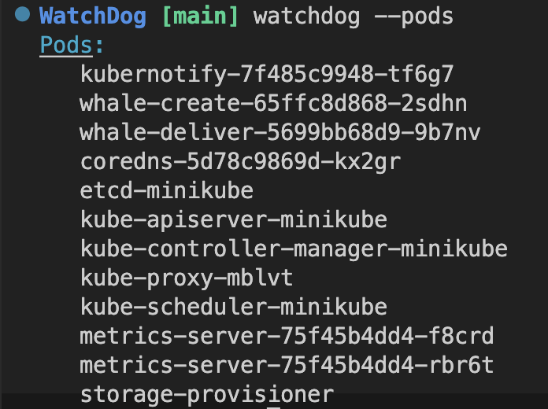
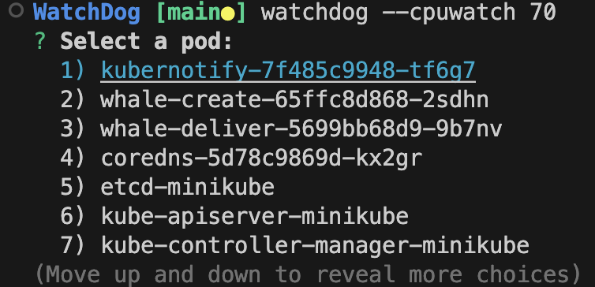

<!-- Improved compatibility of back to top link: See: https://github.com/othneildrew/Best-README-Template/pull/73 -->
<a name="readme-top"></a>

<!-- PROJECT SHIELDS -->
<!--
*** I'm using markdown "reference style" links for readability.
*** Reference links are enclosed in brackets [ ] instead of parentheses ( ).
*** See the bottom of this document for the declaration of the reference variables
*** for contributors-url, forks-url, etc. This is an optional, concise syntax you may use.
*** https://www.markdownguide.org/basic-syntax/#reference-style-links
-->
[![Contributors][contributors-shield]][contributors-url]
[![Forks][forks-shield]][forks-url]
[![Stargazers][stars-shield]][stars-url]
[![Issues][issues-shield]][issues-url]
[![MIT License][license-shield]][license-url]
[![LinkedIn][linkedin-shield]][linkedin-url]


<!-- PROJECT LOGO -->
<br />
<div align="center">
  <a href="https://github.com/WatchDogCLI/WatchDog">
    
  </a>

<h3 align="center">WatchDogCLI</h3>

  <p align="center">
    Simple, custom command line monitoring for local kubernetes development. 
    <br />
    <a href="https://github.com/WatchDogCLI/WatchDog.git"><strong>Explore the docs »</strong></a>
    <br />
    <br />
    <a href="https://github.com/WatchDogCLI/WatchDog">View Demo</a>
    ·
    <a href="https://github.com/WatchDogCLI/WatchDog/issues">Report Bug</a>
    ·
    <a href="https://github.com/WatchDogCLI/WatchDog/issues">Request Feature</a>
  </p>
</div>

<!-- TABLE OF CONTENTS -->
<details>
  <summary>Table of Contents</summary>
  <ol>
    <li>
      <a href="#about-the-project">About The Project</a>
      <ul>
        <li><a href="#built-with">Built With</a></li>
      </ul>
    </li>
    <li>
      <a href="#getting-started">Getting Started</a>
      <ul>
        <li><a href="#prerequisites">Prerequisites</a></li>
        <li><a href="#installation">Installation</a></li>
      </ul>
    </li>
    <li><a href="#usage">Usage</a></li>
    <li><a href="#contributing">Contributing</a></li>
    <li><a href="#license">License</a></li>
    <li><a href="#contact">Contact</a></li>
    <li><a href="#acknowledgments">Acknowledgments</a></li>
  </ol>
</details>


<!-- ABOUT THE PROJECT
## About The Project

[![Product Name Screen Shot][product-screenshot]](https://example.com)

<!-- Here's a blank template to get started: To avoid retyping too much info. Do a search and replace with your text editor for the following: `WatchDogCLI`, `WatchDog`, `twitter_handle`, `linkedin_username`, `email_client`, `email`, `project_title`, `project_description` -->

<!-- <p align="right">(<a href="#readme-top">back to top</a>)</p> --> 

<!-- ### Built With

* [![Minikube][]][Minikube-url]
* [![React][React.js]][React-url]
<!-- * [![Vue][Vue.js]][Vue-url]
* [![Angular][Angular.io]][Angular-url]
* [![Svelte][Svelte.dev]][Svelte-url]
* [![Laravel][Laravel.com]][Laravel-url]
* [![Bootstrap][Bootstrap.com]][Bootstrap-url]
* [![JQuery][JQuery.com]][JQuery-url] -->

<!-- <p align="right">(<a href="#readme-top">back to top</a>)</p> -->


<!-- GETTING STARTED -->
## Getting Started


### Prerequisites

1. Install [Minikube][Minikube-url]

2. Install [Docker][Docker-url]

3. Ensure minikube is running
   ```sh
   minikube start
   ```

### Installation

1. Install NPM package
   ```sh
   npm install watchdogcli
   ```

2. Configure local metrics server
   ```sh
   watchdog --start
   ```

<p align="right">(<a href="#readme-top">back to top</a>)</p>


<!-- USAGE EXAMPLES -->
## Usage

1. List pods/containers/nodes
   ```sh
   watchdog --[resourcetype]
   ```
      


2. Set a CPU usage alert threshold for a pod
   ```sh
   watchdog --cpuwatch 70
   ```
   


3. Provide crash alerts (as well as any CPU alerts set prior with --cpuwatch)
   ```sh
   watchdog --watch
   ```


4. Get metrics for all pods
   ```sh
   watchdog --metrics
   ```


### Complete List of Commands

| Command       | Description                                         |
|---------------|-----------------------------------------------------|
| --start       | Installs metric server                              |
| --pods        | Displays all running pods                              |
| --nodes       | Displays all running nodes                             |
| --containers  | Displays all running containers                        |
| --metrics     | Displays metrics for a specific pod                    |
| --nodeusage   | Displays metrics for the one node                      |
| --podusage    | Displays metrics for a specific pod                    |
| --podpercent  | Displays metric percent for a specific pod             |
| --cpuwatch    | Sets a pod CPU usage alert threshold (note: include a number after a space after the flag) |
| --watch       | Runs watchdog to provide pod crash, pod start, and CPU threshold alerts (set prior using --cpuwatch) |
| --help        | Displays available commands                            |
| --wizard      | Launches a help wizard                              |


<p align="right">(<a href="#readme-top">back to top</a>)</p>


<!-- ROADMAP
## Roadmap

- [ ] Feature 1
- [ ] Feature 2
- [ ] Feature 3
    - [ ] Nested Feature -->


<!-- CONTRIBUTING -->
## Contributing

Contributions are what make the open source community such an amazing place to learn, inspire, and create. Any contributions you make are **greatly appreciated**.

If you have a suggestion that would make this better, please fork the repo and create a pull request. You can also simply open an issue with the tag "enhancement".
Don't forget to give the project a star! Thanks again!

1. Fork the Project
2. Create your Feature Branch (`git checkout -b feature/AmazingFeature`)
3. Commit your Changes (`git commit -m 'Add some AmazingFeature'`)
4. Push to the Branch (`git push origin feature/AmazingFeature`)
5. Open a Pull Request

See the [open issues](https://github.com/WatchDogCLI/WatchDog/issues) for a full list of proposed features (and known issues).

<p align="right">(<a href="#readme-top">back to top</a>)</p>


<!-- LICENSE -->
## License

Distributed under the MIT License. See `LICENSE.txt` for more information.

<p align="right">(<a href="#readme-top">back to top</a>)</p>


<!-- CONTACT -->
## Contact

Ajax Abernathy - [@twitter_handle](https://twitter.com/twitter_handle) - email@email_client.com
Arjun V - [@twitter_handle](https://twitter.com/twitter_handle) - email@email_client.com
Jerry Perez - [@twitter_handle](https://twitter.com/twitter_handle) - email@email_client.com
Oliver Wendell-Braly - [@twitter_handle](https://twitter.com/twitter_handle) - email@email_client.com

Project Link: [https://github.com/WatchDogCLI/WatchDog](https://github.com/WatchDogCLI/WatchDog)

<p align="right">(<a href="#readme-top">back to top</a>)</p>


<!-- ACKNOWLEDGMENTS -->
## Acknowledgments

* []()
* []()
* []()

<p align="right">(<a href="#readme-top">back to top</a>)</p>


<!-- MARKDOWN LINKS & IMAGES -->
<!-- https://www.markdownguide.org/basic-syntax/#reference-style-links -->
[contributors-shield]: https://img.shields.io/github/contributors/WatchDogCLI/WatchDog.svg?style=for-the-badge
[contributors-url]: https://github.com/WatchDogCLI/WatchDog/graphs/contributors
[forks-shield]: https://img.shields.io/github/forks/WatchDogCLI/WatchDog.svg?style=for-the-badge
[forks-url]: https://github.com/WatchDogCLI/WatchDog/network/members
[stars-shield]: https://img.shields.io/github/stars/WatchDogCLI/WatchDog.svg?style=for-the-badge
[stars-url]: https://github.com/WatchDogCLI/WatchDog/stargazers
[issues-shield]: https://img.shields.io/github/issues/WatchDogCLI/WatchDog.svg?style=for-the-badge
[issues-url]: https://github.com/WatchDogCLI/WatchDog/issues
[license-shield]: https://img.shields.io/github/license/WatchDogCLI/WatchDog.svg?style=for-the-badge
[license-url]: https://github.com/WatchDogCLI/WatchDog/blob/master/LICENSE.txt
[linkedin-shield]: https://img.shields.io/badge/-LinkedIn-black.svg?style=for-the-badge&logo=linkedin&colorB=555
[linkedin-url]: https://linkedin.com/in/linkedin_username
[product-screenshot]: images/screenshot.png
[minikube]: https://img.shields.io/badge/React-20232A?style=for-the-badge&logo=react&logoColor=61DAFB 
[Minikube-url]: https://minikube.sigs.k8s.io/
[Docker-url]: https://www.docker.com/
[Next.js]: https://img.shields.io/badge/next.js-000000?style=for-the-badge&logo=nextdotjs&logoColor=white
[Next-url]: https://nextjs.org/
[React.js]: https://img.shields.io/badge/React-20232A?style=for-the-badge&logo=react&logoColor=61DAFB
[React-url]: https://reactjs.org/
[Vue.js]: https://img.shields.io/badge/Vue.js-35495E?style=for-the-badge&logo=vuedotjs&logoColor=4FC08D
[Vue-url]: https://vuejs.org/
[Angular.io]: https://img.shields.io/badge/Angular-DD0031?style=for-the-badge&logo=angular&logoColor=white
[Angular-url]: https://angular.io/
[Svelte.dev]: https://img.shields.io/badge/Svelte-4A4A55?style=for-the-badge&logo=svelte&logoColor=FF3E00
[Svelte-url]: https://svelte.dev/
[Laravel.com]: https://img.shields.io/badge/Laravel-FF2D20?style=for-the-badge&logo=laravel&logoColor=white
[Laravel-url]: https://laravel.com
[Bootstrap.com]: https://img.shields.io/badge/Bootstrap-563D7C?style=for-the-badge&logo=bootstrap&logoColor=white
[Bootstrap-url]: https://getbootstrap.com
[JQuery.com]: https://img.shields.io/badge/jQuery-0769AD?style=for-the-badge&logo=jquery&logoColor=white
[JQuery-url]: https://jquery.com 